# Generating Colour Palettes Randomly

Selecting colours that go well together according to humans is an art. It's easy to pick up colours, but it's harder to make most people happy while maintaining originality.

Because overengineering is my passion, this article will start with a basic method to generate random colours, present better methods, and then conclude with a bespoke micro GPT Artificial Intelligence (AI).

## Why Generate Random Colours? Can't You Pick Them by Hand?

I want to implement a [procedural](https://en.wikipedia.org/wiki/Procedural_generation) [watch face](https://en.wikipedia.org/wiki/Clock_face) for my sport watch. Each minute on the watch should have a unique colour palette never seen before. That's many colours to choose from, so I need automation.

Assuming a common watch and a 4-colour palette changing randomly every minute, I need about 50 million unique palettes to cover an optimistic human lifetime. With a shorter 10-year period, I still need about 5 million unique palettes.

I don't want duplicate palettes, but it's thankfully very unlikely, as modern watches can display millions of colours. Using [the birthday paradox](https://en.wikipedia.org/wiki/Birthday_problem), we can assume that it would take 630 million years before we have a 50% chance to see the same set of colours more than once. Of course it's difficult to distinguish between very similar colours, and some palettes should be rejected as they would lack contrast (4 shades of very similar grey for example). Assuming a much smaller colour space and no palettes with too low [contrast](https://www.w3.org/WAI/WCAG22/Understanding/contrast-minimum.html), we are still talking about years before we likely generate a palette twice. Good enough for me.

## Naive sRGB Random Generation

A very simple method is to stay in the [sRGB](https://en.wikipedia.org/wiki/SRGB) colour space. In sRGB, the most common colour space on computers, colours are represented as a mix of Red, Green, and Blue. Each channel takes a value between 0 and 255. To generate one colour, one could generate 3 random numbers between 0 and 255. Voila.

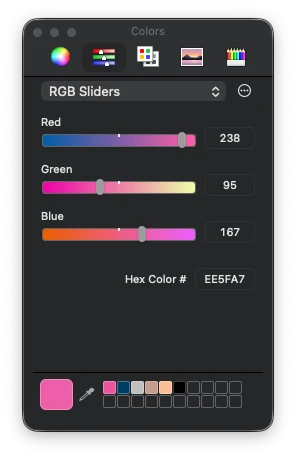

Repeat this 4 times and you have a 4-colour palette. If the palette lacks [accessibility contrast](https://www.w3.org/WAI/WCAG22/Understanding/contrast-minimum.html) (e.g. all colours are similar), just start again. This is very fast to compute.

But generating random colours like this is not great. The colours look very artificial and computer generated. It does have a specific look, so it's not uninteresting, but it's not what I wanted.

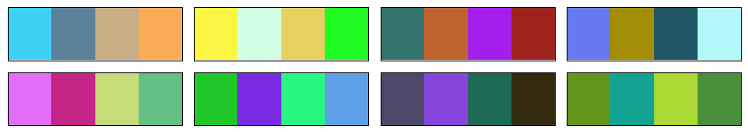

## Switching to More Interesting Colour Spaces: OkLab/OKLCH

A quick improvement over the previous method is switching to a better colour space. sRGB is the standard for computer screens, but it's not very good for this task. Mixing RGB values by hand is difficult. You kinda know that adding makes it brighter, subtracting makes it darker, and adding only in the blue channel makes it somewhat more blue, but it's neither intuitive nor linear.

[A perceptual colour space](https://en.wikipedia.org/wiki/Color_space#Perceptually_uniform_color_spaces) is much better. The colours are well distributed and the channels are more intuitive.

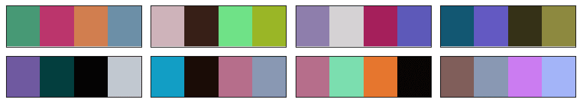

I selected the [OkLab](https://en.wikipedia.org/wiki/Oklab_color_space) colour space, because it's modern and quite OK. Some colour spaces are complex to implement, OkLab is not. In its [OKLCH](https://en.wikipedia.org/wiki/Oklab_color_space#Cylindrical_form:_OKLCh) variant, the channels are Lightness, Chroma, and Hue. Lightness is how bright the colour is, Chroma is how colourful it is, and Hue is the colour itself. This is intuitive.

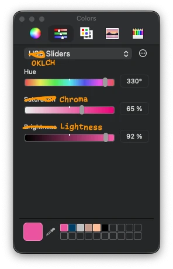

*Artistic representation of an OKLCH colour picker.*

To generate random colours in this space, you can generate random values for Lightness, Chroma, and Hue. However, you can easily generate OKLCH colours that cannot be displayed on a common sRGB screen using this method, as the colour could be too colourful for your screen, for example. When a colour doesn't exist in the sRGB colour space, you can either reject the colour and attempt again, or select the nearest sRGB colour via [gamut mapping](https://en.wikipedia.org/wiki/Color_management#Gamut_mapping).

As for the sRGB method, you can generate 4 colours and re-roll until the palette is good enough.

To be honest, this method is pretty good and a step above the naive sRGB method. I should probably have stopped there. It can generate horrendous palettes with no taste though.

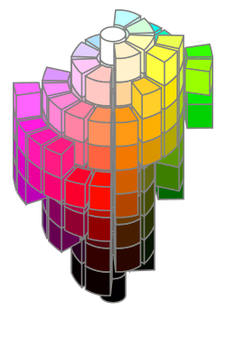

*A 3D OKLCH colour wheel. Looks fancy. [CC0 1.0 - Wikimedia Commons.](https://commons.wikimedia.org/wiki/File:Oklch_isometric_rgb.svg)*

## Classical Colour Wheel Methods

A classic way to generate colour palettes when you are uninspired is to use [colour wheel](https://en.wikipedia.org/wiki/Color_wheel) methods. For example, you start with a colour and generate a [complementary colour](https://en.wikipedia.org/wiki/Complementary_colors) by rotating the hue wheel by 180 degrees. Or you generate a triadic palette by rotating the hue wheel by 120 degrees twice. You can add a bit of random offsets to the hue, chroma, and lightness, but that's usually about it.

This method generates pretty good palettes and could be a step above a completely random method. It also tends to lack originality as it's a common method.

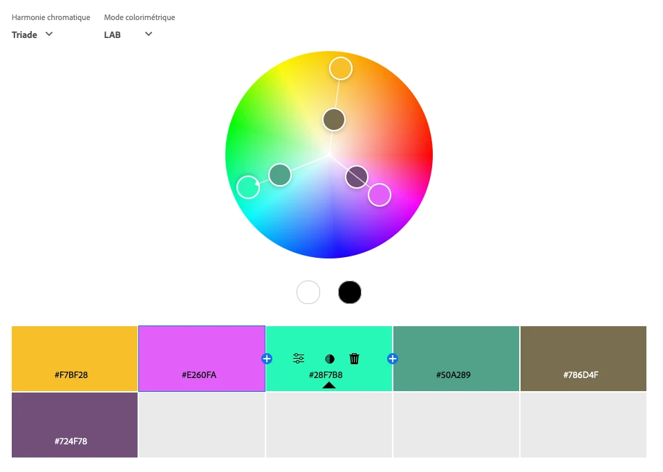

But if you want a solid fast method to generate good palettes, generate a random colour in OKLCH, rotate the hue by 180 degrees or 120 degrees twice, add some small random offsets, generate a bright non-colourful one and a dark non-colourful one, and you have something that will work well most of the time.

## Picking Colours from an Image

Another method is to extract colours from an image. If you have an image with beautiful colours, you can generate a palette from it. Extracting a few colours from an image is a complete field of research in itself. There are a lot of methods to do it, and none is perfect.

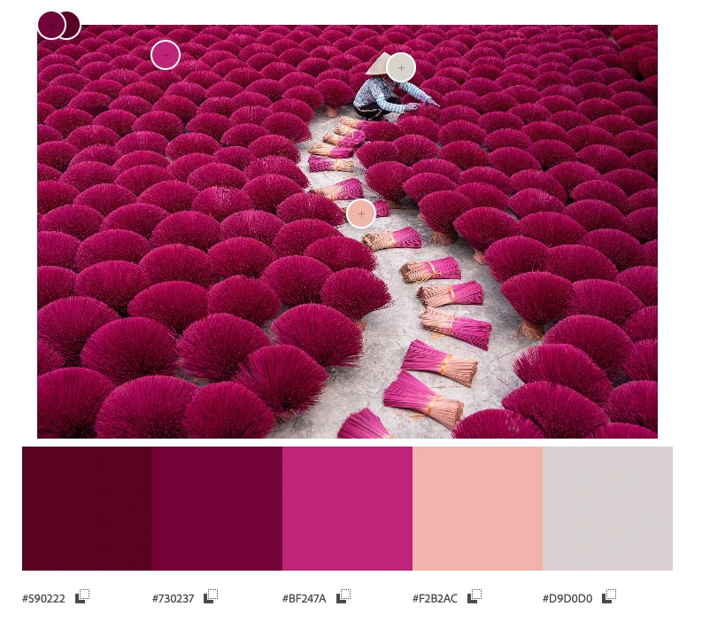

*Extracting colours from Wikipedia's picture of the year 2023. [CC BY-SA 4.0 - Wikipedia Commons.](https://commons.wikimedia.org/wiki/File:Incense_in_Vietnam.jpg)*

I don't claim to have the best recipe to automatically pick colours from an image, but here is mine that works well:

- Convert the image to the OkLab colour space. As we saw earlier, OkLab is a better colour space than sRGB.
- Focus on the luminance L channel:
  - Resize/downsample by a factor of 4 using a [Lanczos filter](https://en.wikipedia.org/wiki/Lanczos_resampling). This is mostly to speed up and ignore the smallest details in the image.
  - Use the [Sobel filter](https://en.wikipedia.org/wiki/Sobel_operator) to identify where the image has the most details, where the luminance changes the most, both vertically and horizontally. The higher the value, the more details there are.
  - Resize the resulting image back to the original size, using [bilinear interpolation](https://en.wikipedia.org/wiki/Bilinear_interpolation).
  - Turn the values into weights from 1 to 4 using a linear scale between the minimum and maximum values.
- Compute the [K-means](https://en.wikipedia.org/wiki/K-means_clustering) clustering algorithm on each OkLab pixel of the image, using the weights computed in the previous steps.
- Convert the clusters back to sRGB and you have your palette.

*Automatically extracted palette from the previous image. Good enough at scale.*

The secret sauce is to use Sobel filters on the OkLab luminance channel to compute weights for the K-means algorithm. This way, colours that are in areas of the image with more details are given more importance. This is not always what you want, but I found that it works well for my images, notably the ones having text. Text is quite visible to humans, but it doesn't always use many pixels, so you need to give more importance to the areas that contain text.

## Messing Around with Artificial Intelligence

I wasn't satisfied with the previous methods, so I decided that I would make an AI model to generate colour palettes. This has been done before, but I wanted to do it myself for fun. It would also have to run on a watch.

How hard could it be to generate 12 8-bit numbers with an AI? Turns out, it was hard and I gave up for a year until I finally found a method that worked.

## Stealing Data, the First Step of Any AI Project

The first step of building an AI model is to get data. Hopefully good data. As it's a grey area, I won't go into details about where and how I got the data. But let's say that I visited a few well-known websites about human-made colour palettes. Some had easy-to-scrape data, some were a bit more difficult, but I ended up with a few thousand human-made colour palettes that people took the time to share online. In my opinion, most of those palettes are pretty good, and a big step above the random palettes I generated so far.

I think it's safe to say that graphic designers are better at creating colour palettes than random number generators in the OkLab colour space.

*Screenshot of some highlighted colour palettes in Adobe Color. One of the many colour palettes websites.*

## Generating more Data using Music Album Covers

You won't get very far with a few thousand data points when training an AI. So I needed more data. I eventually settled on extracting colour palettes from music album covers. Music album covers usually look good, have a lot of beautiful colours, have bold graphic design, have text with good contrast, and there are a lot of them. It's also very trivial to acquire datasets of many music album covers. The ones I gathered included about 80,000 album covers from famous albums of all times and genres.

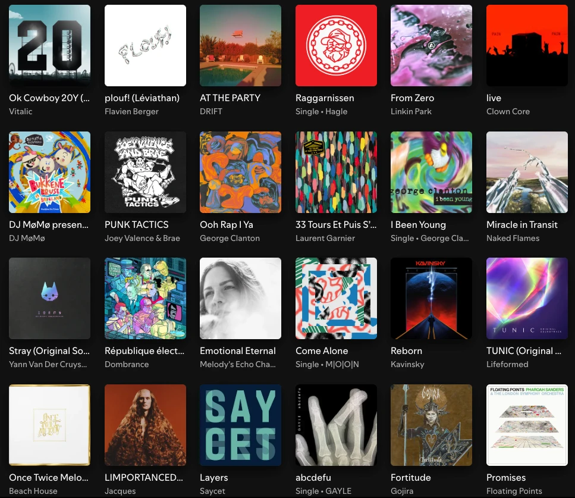

*Screenshot of recent music albums in my digital collection. It shows a lot of colour palettes variety.*

I also considered company logos, websites, application icons, but they weren't as interesting and varied as music album covers.

Music album covers aren't perfect, and I noticed that many albums had a brown/beige colour palette, perhaps old design trends, and perhaps also because of the skin colours of the people on the covers. Still, that was a lot of good palettes I could compute using my colour extraction method explained above.

## Final Training Dataset

I made the final dataset, representing a bit more than 100,000 palettes of 4 colours. Each palette is unique and likely never seen before, as the human-made palettes have been slightly modified with some very soft random noise.

Here it is, available in `.csv` format: [dataset/dataset.csv](../dataset/dataset.csv).

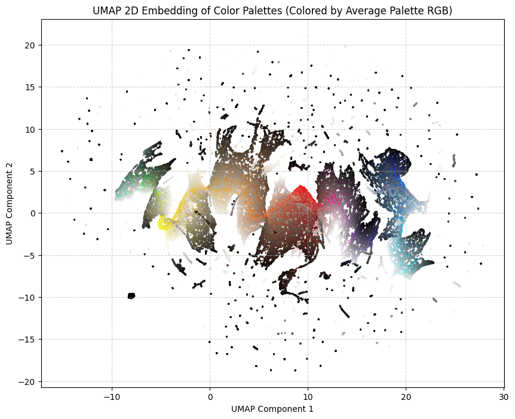

*[UMAP](https://en.wikipedia.org/wiki/Nonlinear_dimensionality_reduction#Uniform_manifold_approximation_and_projection_(UMAP)) projection of the clustered colours. I found it in my notes. It looks cool. You can see that green is not common and various shades of beige and brown are.*

## AI Methods That Did NOT Work

So now, I had a good dataset and a simple problem.

I started with the most old-fashioned method, a [multilayer perceptron](https://en.wikipedia.org/wiki/Multilayer_perceptron) (MLP). It was once described to me as the kindergarten toy of AI models. It's usually the thing you implement first when you start learning about AI.

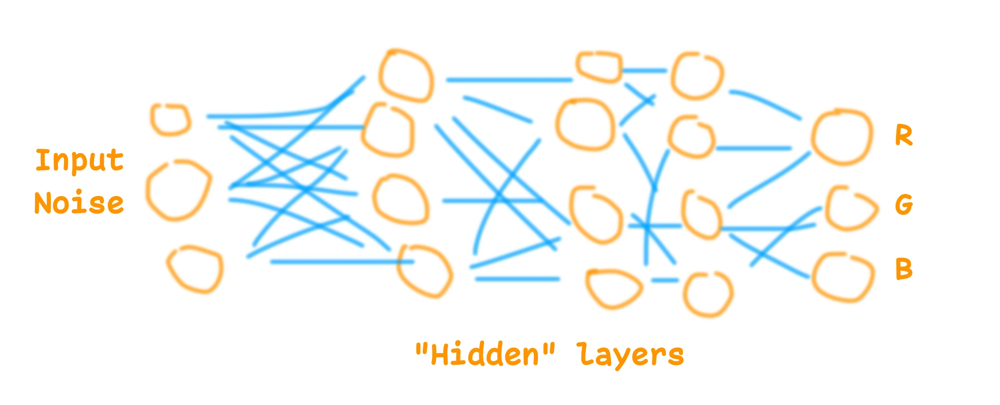

*My simplified MLP architecture. I do not recommend it.*

This didn't work and suffered from the same problem as the other methods I tried: it would aim for the average. Some models would generate the most boring common palette. Some would just generate shades of grey or slightly brownish greyish colours. They all seemed to not grasp the patterns and logic behind the palettes. Basic rules like "if the first colour is white, the second is going to be black" worked, but anything more complex than this didn't work so well.

I experimented with many variations of MLP, and then switched to [GAN](https://en.wikipedia.org/wiki/Generative_adversarial_network) models (Generative Adversarial Networks). That worked perhaps a bit better, but still suffered from the same problem, and was not good enough. I could generate random colour palettes using GAN AI models, but to be honest, not very good ones. And training them more only resulted in [mode collapse](https://en.wikipedia.org/wiki/Mode_collapse), where the model would generate only one palette.

Thus, I gave up. I think it is possible to use those AI model architectures to generate beautiful colour palettes. I've seen others doing it, but I didn't manage.

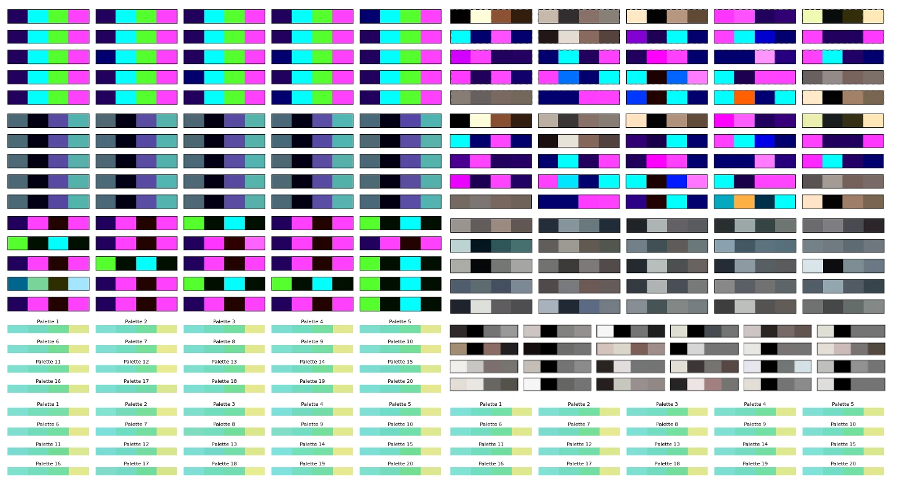

*A collection of failed palettes generated by the various methods I tried. Mostly [mode collapses](https://en.wikipedia.org/wiki/Mode_collapse).*

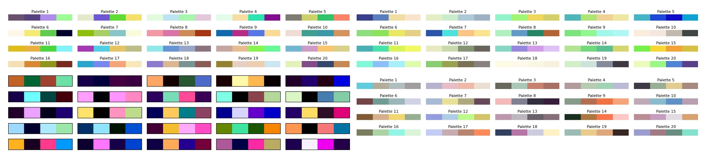

*Some less failed palettes from the better models, but still not good enough. Some weren't that bad looking back.*

## Microgpt to the Rescue

Then, about a year later, [microgpt was released](https://karpathy.github.io/2026/02/12/microgpt/). It's a micro LLM inspired by the [GPT](https://en.wikipedia.org/wiki/Generative_pre-trained_transformer) [architecture](https://en.wikipedia.org/wiki/Transformer_(deep_learning_architecture)), small and easy to understand. It's neat.

I tried it with the default example, generating first names. It worked so well that I decided to test it for this project. It is small enough to fit on a watch, and it seems to actually work at understanding some of the patterns in names, so why not colour palettes.

For the [tokenization](https://en.wikipedia.org/wiki/Tokenization_(data_science)), I took the colours in the OKLCH colour space, of course, and went with 42 tokens for each channel. Plus one token to separate the colours, and one token to separate the palettes.

I trained it on 1000 steps with the whole dataset, and that was it. It worked.

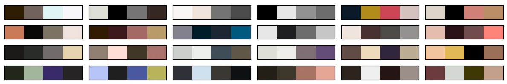

Of course the model suffers from similar problems to the previous methods. It's a bit brownish and greyish perhaps, but turning the temperature up and using a few tricks allows it to generate more creative and original palettes. Having the possibility to turn the temperature is a big advantage of this architecture. The model also understood some obvious patterns in colour palettes, which no other small models I made seemed to understand.

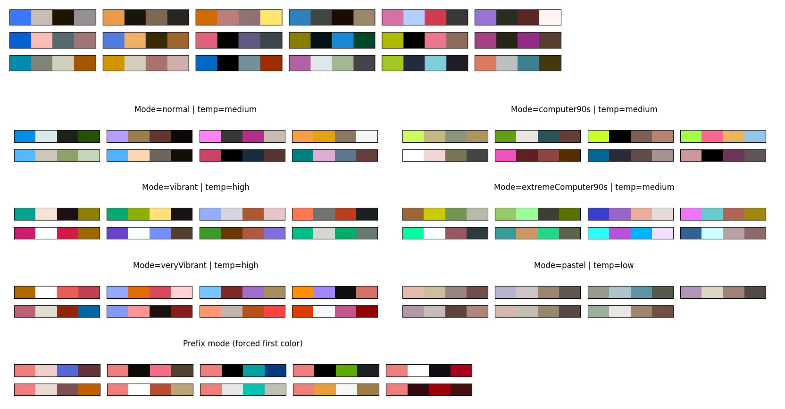

The model can and will generate some invalid palettes. The naive implementation often produces invalid data. With OKLCH colours, I expect L C H tokens in this order, and I could get, for example, C C H tokens. It's because a high [temperature](https://en.wikipedia.org/wiki/Softmax_function#Reinforcement_learning) increases the chance of not selecting valid tokens. My fix was to improve the sampling method to only sample from valid and logical tokens. A bit like how commercial LLMs used to struggle with writing syntactically valid JSON or Python code, until they improved their next token sampling logic.

The model can still generate colours that are not displayable on a common sRGB screen, or palettes with too low contrast. My solution is to try again when a palette is rejected ([rejection sampling](https://en.wikipedia.org/wiki/Rejection_sampling)).

I think the microgpt for colour palettes model is a success. It didn't manage to reproduce the beauty of many palettes from the training dataset, but still, it generates colour palettes that are in my opinion more pleasant and interesting than the previous methods mentioned above. It has its style but it's creative, which makes sense for a GPT model.

It also reacts well to starting colours. You can give it one or two start colours, and it will generate the rest of the palette.

## Runtime

The model currently runs on this website, it's pretty lightweight. It's a 7,424-parameter GPT, so not a very large language model at all. The weights are about 15kB once [quantized](https://en.wikipedia.org/wiki/Quantization_(signal_processing)) in [16-bit floats](https://en.wikipedia.org/wiki/Half-precision_floating-point_format). To give a comparison, the training dataset is about 1.7MB compressed.

While microgpt is written in Python, it's relatively easy to convert to other programming languages, such as JavaScript or [Garmin Monkey C](https://developer.garmin.com/connect-iq/monkey-c/).

I made an application where you can use it to generate colour palettes, following various constraints or starting colours: [MicroColourGPT 3000](../index.html).

The [weights](../weights/) are available, as is the [source code](https://github.com/fungiboletus/MicroColourGPT3000).

## What I Won't Do Next

It's always possible to improve a side project. I could get a better and bigger dataset, use a better model, have a better training run. I could perhaps add some features such as palettes from fashion design, palettes from French touch electro album covers, and so on. I won't do that. I had fun, and it happened to work.

In case you came to this page first, I made an application that you can use to generate colour palettes: [MicroColourGPT 3000](../index.html). I will also eventually make this watch face. Hopefully I can fit 7424 numbers on my watch using Garmin Monkey C.
